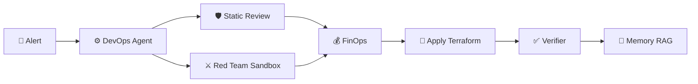

<div align="center">
  <h1>☁️ Cloud-Orchestra</h1>
  <p><b>An Autonomous Multi-Agent Cloud DevOps Orchestrator</b></p>
  
  <p>
    
    
    
    
  </p>
</div>

<br />

**Cloud-Orchestra** is a research-grade Multi-Agent system that fully automates Cloud DevOps. When an alert fires (e.g., High CPU), the system orchestrates 10 specialized AI agents to diagnose, write Terraform, securely review it, and deploy the fix via a deterministic Saga Workflow.

## ✨ Key Features

- **Closed-Loop Self-Healing:** Actively verifies applied fixes and rolls back automatically if unresolved.
- **Adversarial Validation:** Deploys infrastructure to a live sandbox for Red Team penetration testing prior to production.
- **RL-Powered FinOps:** Utilizes PPO reinforcement learning to continuously optimize for cheaper cloud configurations.
- **Persistent Shared Memory:** RAG-enabled Vector DB allows agents to evolve and learn from past deployments.
- **Full Observability:** Complete decision traces and human-readable PR explanations.
- **Multi-Cloud Harmonization:** Intelligently routes workloads across AWS, GCP, and Azure.

## 🏗️ Architecture



## 🚀 Quick Start

```bash
# 1. Clone & Setup
git clone https://github.com/Jigneshh9/Multi-Agent-Cloud-Orchestrator-Design.git
cd Multi-Agent-Cloud-Orchestrator-Design
python -m venv .venv
source .venv/bin/activate  # Windows: .venv\Scripts\activate

# 2. Install Dependencies
pip install -e ".[api,dev,rl]"

# 3. Run a Remediation Workflow
cloud-orchestra run --problem high_cpu
```

## 📚 Documentation
For complete details on deployment, APIs, and the research paper outline, refer to the [docs/](docs/) directory:
- [`Architecture & Design`](docs/architecture.md)
- [`API Reference`](docs/api.md)
- [`Deployment Guide`](docs/deployment.md)
- [`Research Paper Outline`](docs/paper-outline.md)
